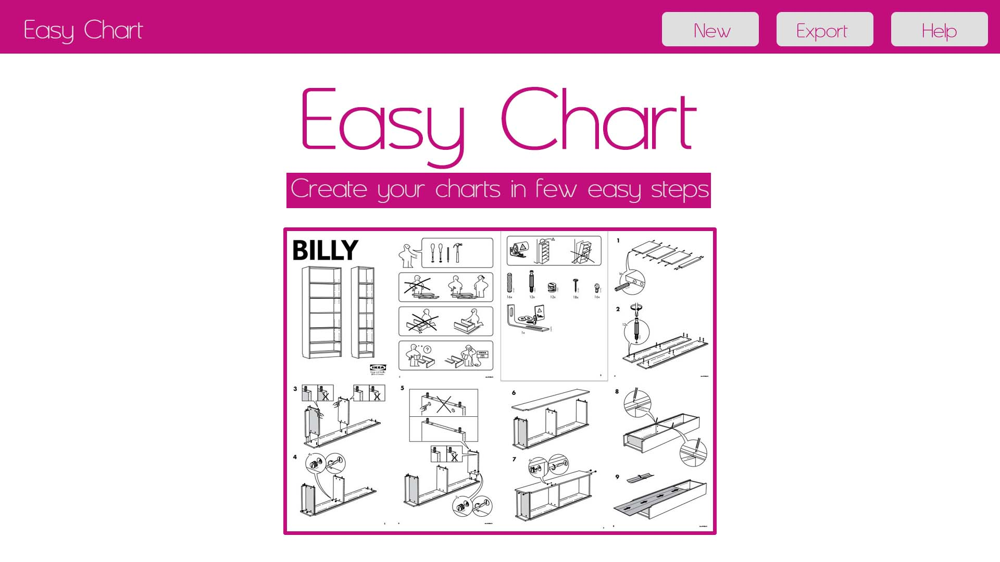
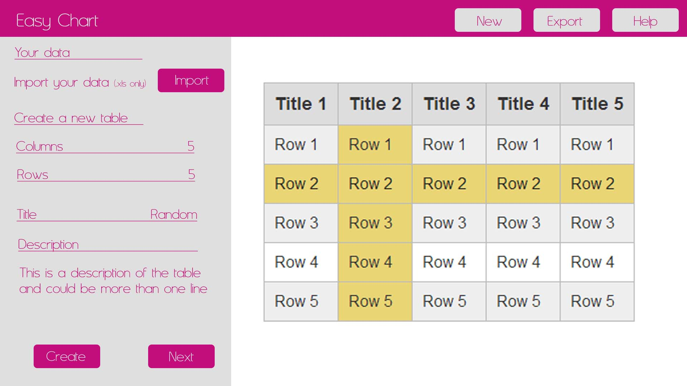

<h1 align="center">Easy Chart Website</h1>

This is a website that allows the user to create different types of charts and download them in PNG format.

 
<h2 align="center"></h2>

[View the live project here.](https://tomaserudito.github.io/easy-chart/)
  
## Project development plan 
 

The development of this project has been divided following the UX five layers model:

<ul>
<li>Strategy: The website wants to allow the user to create, customize and export the chart in a fast and easy way.</li>
<li>Scope: The website need to answer 3 questions:</li>
<ul>
<li>•	What do the website does?</li>
<li>•	Is it easy to create/customize/export the chart?</li>
<li>•	Would the user enjoy the experience?</li>
</ul>
<li>Structure: The website is divided in 2 sections:</li>
<ul>
<li>•	Home – Presentation of the aplication and usage guide.</li>
<li>•	Chart creation – Creation of the chart through the creation tools.</li>
</ul>
<li>Skeleton: The information’s organization is simple so the users can navigate easily through the content, create their chart easily, and they should be able of complete the process fast:</li>
<ul>
<li>•	Header with navigation menu.</li>
<li>•	Steps explanation in the Home page.</li>
<li>•	Easy to use creation's menu.</li>
<li>•	Clear text / icons.</li>
<li>•	Extra information (help / information).</li>
</ul>
<li>Surface: Visual design of the website.</li>
</ul>
 

The mockups of the site present a very clean and simple structure with the instructions on the first page:

 
<h2 align="center"></h2>

In the creation stage there are three separate areas clearly separated

 
<h2 align="center"></h2>
 

## UX Goals 
 

<h3>First Time Visitors</h3>

•	Should be able to answer the 3 questions we proposed, before (What do the website does? / 
Is it easy to create/customize/export the chart? / Would the user enjoy the experience?) easily.

•	Should be able to create the chart and export it easily.

•	Should be comfortable creating different charts and experimenting with them.

•	Should want to share the website with others.

 
<h3>Returning visitors</h3>

•	Should be able to create the chart and export it easily.

•	Should be able to create the chart fast.

•	Should feel comfortable using the aplication.

 
<h3>Frequent visitors</h3>

•	Should be able to create the chart fast.

•	Should choose the aplication as their first choice to create charts online.

 

<h3>UX solutions</h3>
 

<h3>First Time Visitors</h3>

•	Should be able to answer the 3 questions we proposed, before (What do the website does? / 
Is it easy to create/customize/export the chart? / Would the user enjoy the experience?) easily.

<ul>
<li>The name of the company is resume what the application does: charts in an easy way.</li>
<li>The process is simple and straight forward.</li>
<li>The page is not cluttered and it's kept as simple as possible to make the process easy.</li>
</ul>

•	Should be able to create the chart and export it easily.

<ul>
<li>The flow of the process is linear and anything not strictly necessary has been eliminated.</li>
</ul>

•	Should be comfortable creating different charts and experimenting with them.

<ul>
<li>Even the process has been simplified, there are enough options to allow the user to experiment the different types of charts that could be created.</li>
</ul>

•	Should want to share the website with others.

<ul>
<li>The simplicity of the process and speed of the results could create promoters of the site among colleages.</li>
</ul>
 
<h3>Returning visitors</h3>

•	Should be able to create the chart and export it easily.

<ul>
<li>In 14 clicks the user can create a customised chart from one excel file from their computer.</li>
</ul>

•	Should be able to create the chart fast.

<ul>
<li>In 15 seconds the user can create a customised chart from one excel file from their computer.</li>
</ul>

•	Should feel comfortable using the aplication.

<ul>
<li>The process is simple and once that the user has done it once, it becomes intuitive.</li>
</ul>
 
<h3>Frequent visitors</h3>

•	Should be able to create the chart fast.

<ul>
<li>Again, 15 seconds to create a personalized chart.</li>
</ul>

•	Should choose the aplication as their first choice to create charts for the web.

<ul>
<li>When other websites offer lots of different options that requiere time to learn and configurate, with many different options that distract the user from the final result, Easy chart keeps simple the process.</li>
</ul>
 

## Design 
 

The potential customers would be people of any age who need to create a chart. These group of people could be professionals or students and the main reaso to create the chart should be a job or studies necessity. For this reason the website / application is designed to run on a desktop / laptop / tablet with a medium to large screen, and it's not intended to be used on a phone.

The site pretends to be simple and fast, any unnecessary elements has been eliminated.

There are three separate areas clearly separated:

<ul>
<li>Navigation menu with the new button to start the creation of the chart, the export button to download the chart and the help button.</li>
<li>The creation menu on the left hand side.</li>
<li>The main central area where the data and the chart will be displayed.</li>
</ul>

The typography used is Asanine to give a friendly feeling.

## Technologies used 
 

The languages used are:

•	HTML 5

•	CSS

Also, during the creation of the different elements of the project, I used:
	

•	Photoshop – Create and / or edit images like the logo.

•	Bootstrap 4.1.3 – To help with the responsive design.

•	JQuery – Used for the navigation bar on mobiles and the carousel on the index page.

•	Font Awesome – Used for the icons on all the pages.

•	Git – Used for the version control within Gitpod.

•	GitHub – Used to store the project.

•	GitPod – IDE used to develop the project. Used the Code Institute template to setup the IDE environment.

 

## Testing 
 
	

The W3C validator has been used to ensure that every HTML and CSS files are free of syntax errors.

The website has been tested on different browsers:

•	Google Chrome

•	Microsoft Edge

•	Opera

•	Firefox

Also has been tested on different devices:

•	Laptop (Windows)

•	Desktop (Windows)

•	Android tablets

 

More testing has been done about usability and user experience. To achieve this, I proposed to some friends to navigate through the website and answer the questions about the UX goals explained before:

<h3>First Time Visitors</h3>

•	Should be able to answer the 3 questions we proposed, before (What do the website does? / 
Is it easy to create/customize/export the chart? / Would the user enjoy the experience?) easily.

<ul>
<li>The users can identify the use of the site, they can create one chart, once they create the first chart they want to try how the other types of charts look like.</li>
</ul>

•	Should be able to create the chart and export it easily.

<ul>
<li>The users can create the charts very easily.</li>
</ul>

•	Should be comfortable creating different charts and experimenting with them.

<ul>
<li>All the users stayed in the site trying different charts and "playing" with the different options.</li>
</ul>

•	Should want to share the website with others.

<ul>
<li>The simplicity of the process, the different options and speed of the results make the users to recommend the site to others.</li>
</ul>
 
<h3>Returning visitors</h3>

•	Should be able to create the chart and export it easily.

<ul>
<li>Once they used the website once, they were able to create charts very fast and easy.</li>
</ul>

•	Should be able to create the chart fast.

<ul>
<li>Once they used the website once, they were able to create charts very fast and easy.</li>
</ul>

•	Should feel comfortable using the aplication.

<ul>
<li>They found the process of creation very "natural" and "logic".</li>
</ul>
 
<h3>Frequent visitors</h3>

•	Should be able to create the chart fast.

<ul>
<li>After few visits the users could create the charts "without thinking about it".</li>
</ul>

•	Should choose the aplication as their first choice to create charts for the web.

<ul>
<li>All the users that test the application wanted it to use it for they jobs / studies.</li>
</ul>
 

## Bugs 
 

During the development process, and later on during the testing, some bugs / deficiencies have been detected. Some were functionals (links not working,...), some were about interaction (buttons are clearly interactive, accessibility...), some aesthetics (colors, sizes,...)

The most challenging part has been the automation of the creation of the different charts, as needed to use the right data with a thrid party resource that creates the charts.

Also I needed to limitate the number of columns that can be created as having problems with the redimension of the table to contain the data.

There is one circunstance that I didn't find the right solution: When the user creates one table but the data is empty, theres no chart created, but at the same time I should accept that some values could se empty.

 

## Credits 
 

There is some Javascript that it wasn't created by me:
	

•	The file importxls.js (upload the xls file and returns one object) is based on the code from Midhun T P (developer) shared in the page https://www.c-sharpcorner.com/article/reading-a-excel-file-using-html5-jquery/. And modified by me (the parts that I wrote are marked)

•	The file JS_carousel.js (controls the carousel used for the instructions in the first page) is based on the Bootstrap JS Carousel.

•	To create the charts, I used the open source Chart.js (linked on the header) MIT license

•	To download the charts, I use html2canvas (marked in the file myJavascript.js) MIT license

 

<h3>External help</h3> 

To find solutions to some difficulties during the creation of the project, I used:
	

•	Bootstrap documentation

•	W3Schools

•	Stackoverflow

 

## Deployment

<h3> How this Project was Deployed<h3> 

This project was deployed to GitHub pages via the following steps:

1. Log into [GitHub](https://GitHub.com/).
2. From the list of Repositories, select [BAK2K3/hard-drivers](https://github.com/TomasErudito/easy-chart).
3. From the Repositories sub-headings, select "Settings".
4. Under "Options", the first category of settings, scroll down to the GitHub Pages section.
5. From the dropdown list under the "Source" heading, select "main".
6. A second drop-down menu that appears should remain as the default value, "/root".
7. Press Save. 
8. On Page refresh, scroll back down to the GitHub Pages section, and the link to the deployed site will be available in a green sub-section with a tick icon next to it.

As this project was developed on the master branch, all changes made to the repository are immediately reflected in the deployed project.

<h3>How to Run this Project in your Browser</h3> 

1. Install the [Google Chrome](https://www.google.co.uk/chrome/) or [Firefox](https://www.mozilla.org/en-GB/exp/firefox/new/) browser.
2. Install the applicable [GitPod](https://www.gitpod.io/docs/browser-extension/) Browser Extensions for your chosen browser.
4. Create a [GitHub](https://GitHub.com/join) account. 
3. Log in to [Gitpod](https://gitpod.io/login/) using your GitHub account.
4. Visit Hard Driver's [GitHub Repository](https://github.com/TomasErudito/easy-chart).
5. Open the repository in Gitpod:
    * Click the green "Gitpod" icon at the top of the Repository
6. A new workspace will open with the current state of the main branch. Any changes made to the main branch after this point will not be automatically updated in your Gitpod Workspace.

## How to Run this Project Locally

<h3>Cloning the Repository</h3> 

1. Visit Hard Driver's [GitHub Repository](https://github.com/TomasErudito/easy-chart).
2. Click the "Code" dropdown box above the repository's file explorer. 
3. Under the "Clone" heading, click the "HTTPS" sub-heading.
4. Click the clipboard icon, or manually copy the text presented: `https://github.com/TomasErudito/easy-chart.git`
5. Open your preferred IDE (VSCode, Atom, PyCharm, etc).
6. Ensure your IDE has support for Git, or has the relevant Git extension.
7. Open the terminal, and create a directory where you would like the Repository to be stored.
8. Type `git clone` and paste the previously copied text (`https://github.com/TomasErudito/easy-chart.git`) and press enter.
9. The Repository will then be cloned to your selected directory. 

<h3>Manually Downloading the Repository</h3> 

1. Visit Hard Driver's [GitHub Repository](https://github.com/TomasErudito/easy-chart.git).
2. Click the "Code" dropdown box above the repository's file explorer. 
3. Click the "Download ZIP" option; this will download a copy of the selected branch's repository as a zip file.
4. Locate the ZIP file downloaded to your computer, and extract the ZIP to a designated folder which you would like the repository to be stored.

<h3>Opening the Repository</h3> 

1. Open your preferred IDE (VSCode, Atom, PyCharm, etc).
2. Navigate to the chosen directory where the Repository was Cloned/Extracted.
3. You will now have offline access to the contents of the project.

